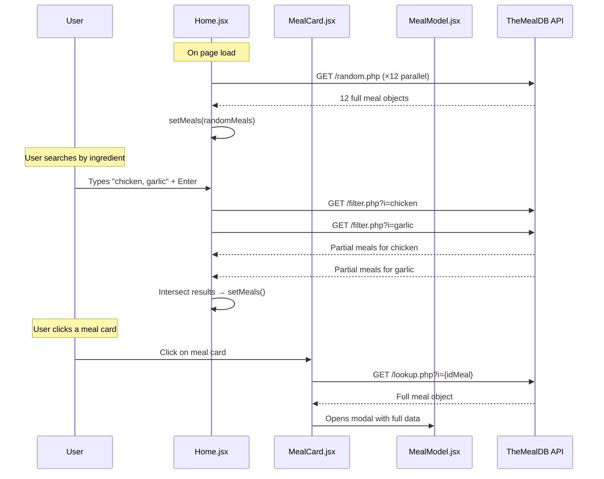
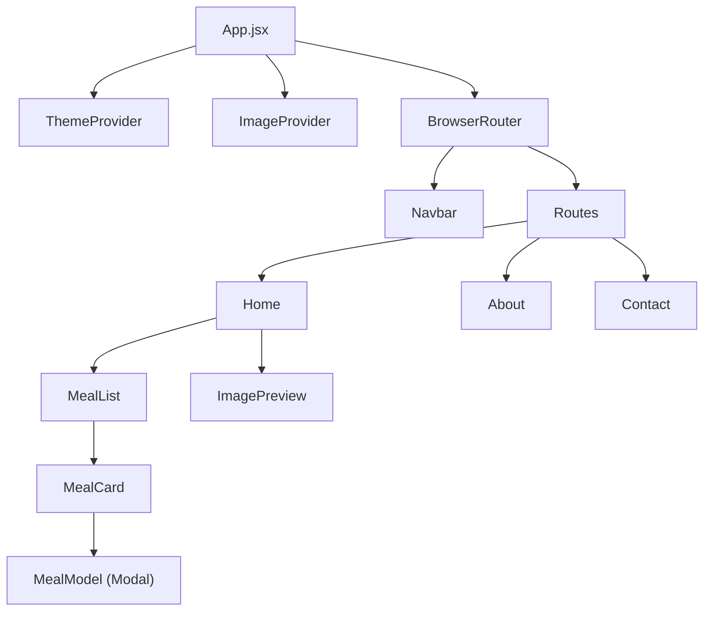

# 🍽️ Mealify (DishFlash) — TheMealDB API Usage Reference

> **Purpose:** Document every TheMealDB API call used in the frontend so you can replicate/proxy them through your own backend.

---

## API Base URL

```
https://www.themealdb.com/api/json/v1/1/
```

> [!IMPORTANT]
> The `1` in the URL is the **free-tier API key**. For production, you should get a [Patreon key](https://www.themealdb.com/api.php) and swap `1` with your key — or, better yet, proxy all calls through your backend so the key is never exposed to the client.

---

## Endpoints Used

### 1. 🎲 Random Meal

| Detail | Value |
|---|---|
| **Endpoint** | `GET /random.php` |
| **Full URL** | `https://www.themealdb.com/api/json/v1/1/random.php` |
| **Used in** | [Home.jsx](file:///d:/Projects/mealify/frontend/src/components/Home.jsx#L22) — `fetchMeals()` |
| **Purpose** | Fetch a single random meal |
| **Params** | None |

**Frontend usage:** Called **12 times in parallel** (`Promise.all`) on initial page load to populate the home grid.

```js
// Home.jsx — Lines 19–25
const promises = Array(12)
  .fill(0)
  .map(() =>
    fetch("https://www.themealdb.com/api/json/v1/1/random.php")
      .then((res) => res.json())
  );
const results = await Promise.all(promises);
const randomMeals = results.map((data) => data.meals[0]);
```

**Response shape:**
```json
{
  "meals": [
    {
      "idMeal": "52772",
      "strMeal": "Teriyaki Chicken Casserole",
      "strMealThumb": "https://www.themealdb.com/images/media/meals/...",
      "strCategory": "Chicken",
      "strArea": "Japanese",
      "strInstructions": "...",
      "strYoutube": "https://www.youtube.com/watch?v=...",
      "strIngredient1": "soy sauce",
      "strMeasure1": "3/4 cup",
      // ... strIngredient2–20, strMeasure2–20
    }
  ]
}
```

---

### 2. 🔍 Filter by Ingredient

| Detail | Value |
|---|---|
| **Endpoint** | `GET /filter.php?i={ingredient}` |
| **Full URL** | `https://www.themealdb.com/api/json/v1/1/filter.php?i=chicken` |
| **Used in** | [Home.jsx](file:///d:/Projects/mealify/frontend/src/components/Home.jsx#L45-L55) — `fetchMealsByIngredient()` |
| **Purpose** | Search meals that contain a specific ingredient |
| **Params** | `i` — ingredient name (single word, e.g. `chicken`, `garlic`) |

**Frontend usage:** Called for each comma/space-separated ingredient the user enters. Results are **intersected** to find meals containing ALL specified ingredients, then limited to 12.

```js
// Home.jsx — Lines 44–55
const fetchMealsByIngredient = async (term) => {
  const res = await fetch(
    `https://www.themealdb.com/api/json/v1/1/filter.php?i=${term}`
  );
  const data = await res.json();
  return data.meals || [];
};
```

**Response shape (partial meal objects — no instructions/ingredients!):**
```json
{
  "meals": [
    {
      "strMeal": "Brown Stew Chicken",
      "strMealThumb": "https://www.themealdb.com/images/media/meals/...",
      "idMeal": "52765"
    }
  ]
}
```

> [!WARNING]
> The filter endpoint returns **abbreviated meal objects** — only `idMeal`, `strMeal`, and `strMealThumb`. To get full details (instructions, ingredients, YouTube link), a separate **lookup** call is required.

---

### 3. 📖 Lookup Full Meal by ID

| Detail | Value |
|---|---|
| **Endpoint** | `GET /lookup.php?i={idMeal}` |
| **Full URL** | `https://www.themealdb.com/api/json/v1/1/lookup.php?i=52772` |
| **Used in** | [MealCard.jsx](file:///d:/Projects/mealify/frontend/src/components/MealCard.jsx#L13-L14) — `fetchFullMealDetails()` |
| **Purpose** | Get complete meal details by meal ID |
| **Params** | `i` — the meal's unique ID (e.g. `52772`) |

**Frontend usage:** Called when a user clicks on a meal card to open the detail modal. This fetches the **full meal object** including instructions, all 20 ingredient/measure pairs, and YouTube link.

```js
// MealCard.jsx — Lines 10–26
const fetchFullMealDetails = async () => {
  const res = await fetch(
    `https://www.themealdb.com/api/json/v1/1/lookup.php?i=${meal.idMeal}`
  );
  const data = await res.json();
  if (data.meals) {
    setFullMeal(data.meals[0]);
  }
};
```

**Response shape (same full object as random.php):**
```json
{
  "meals": [
    {
      "idMeal": "52772",
      "strMeal": "Teriyaki Chicken Casserole",
      "strCategory": "Chicken",
      "strArea": "Japanese",
      "strInstructions": "Preheat oven to 350...",
      "strMealThumb": "https://www.themealdb.com/images/media/meals/...",
      "strYoutube": "https://www.youtube.com/watch?v=4aZr5hZXP_s",
      "strIngredient1": "soy sauce",
      "strMeasure1": "3/4 cup",
      "strIngredient2": "water",
      "strMeasure2": "1/2 cup",
      // ... up to strIngredient20 / strMeasure20
    }
  ]
}
```

---

## Meal Data Fields Used by the Frontend

The [MealModel.jsx](file:///d:/Projects/mealify/frontend/src/context/MealModel.jsx) modal consumes these fields:

| Field | Type | Used For |
|---|---|---|
| `idMeal` | `string` | Unique key for lists, lookup param |
| `strMeal` | `string` | Meal name display |
| `strMealThumb` | `string` (URL) | Meal thumbnail image |
| `strCategory` | `string` | Category label (e.g. "Chicken") |
| `strArea` | `string` | Cuisine region (e.g. "Japanese") |
| `strInstructions` | `string` | Full cooking instructions text |
| `strYoutube` | `string` (URL) | YouTube recipe video link |
| `strIngredient1`–`strIngredient20` | `string` | Ingredient names (up to 20) |
| `strMeasure1`–`strMeasure20` | `string` | Ingredient measures (up to 20) |

---

## Data Flow Diagram



---

## 🛠️ Backend Proxy Recommendations

When building your backend, consider creating these proxy endpoints:

| Backend Route | Proxies To | Notes |
|---|---|---|
| `GET /api/meals/random?count=12` | `/random.php` × N | Batch multiple random calls server-side |
| `GET /api/meals/search?ingredients=chicken,garlic` | `/filter.php?i={each}` | Handle intersection logic server-side |
| `GET /api/meals/:id` | `/lookup.php?i={id}` | Cache results for frequently accessed meals |
| `POST /api/contact` | — | Handle contact form (currently simulated with `setTimeout`) |

> [!TIP]
> **Benefits of proxying:**
> - Hide your API key from the client
> - Add caching (meals don't change often)
> - Reduce client-side API calls (batch random meals in one backend call)
> - Handle the ingredient intersection logic server-side for better performance
> - Add rate limiting to protect against abuse

---

## Frontend Components Architecture



| Component | API Dependency |
|---|---|
| `Home.jsx` | `random.php`, `filter.php` |
| `MealCard.jsx` | `lookup.php` |
| `MealModel.jsx` | Receives data from MealCard (no direct API call) |
| `About.jsx` | None — static content |
| `Contact.jsx` | None — form submission simulated (needs backend) |
| `Navbar.jsx` | None |
| `Footer.jsx` | None (not currently wired into App.jsx routes) |

---

## ⚠️ Issues to Note for Backend Development

1. **Contact form is simulated** — [Contact.jsx L79](file:///d:/Projects/mealify/frontend/src/components/Contact.jsx#L79) uses `setTimeout` to fake submission. This needs a real `POST /api/contact` endpoint.

2. **12 parallel random calls** — The home page fires 12 separate `fetch` calls to `random.php`. Your backend should batch this into a single endpoint.

3. **No error retries** — Failed API calls just show an error message. Consider adding retry logic in the backend.

4. **Footer not rendered** — `Footer.jsx` exists but isn't included in `App.jsx`. Wire it in if needed.

5. **Deprecated `onKeyPress`** — [Home.jsx L129](file:///d:/Projects/mealify/frontend/src/components/Home.jsx#L129) uses `onKeyPress` which is deprecated; should be `onKeyDown`.
